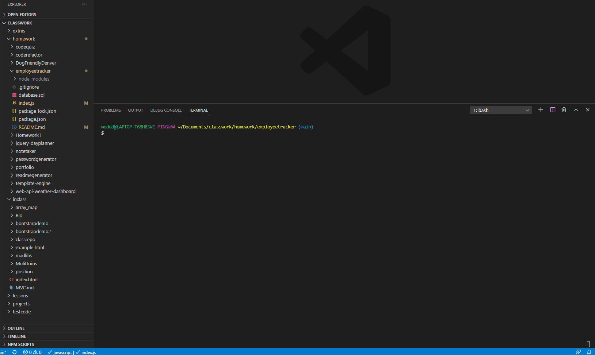

# Employee Tracker

  ## Description.
  
  Developers are often tasked with creating interfaces that make it easy for non-developers to view and interact with information stored in databases. Often these interfaces are known as **C**ontent **M**anagement **S**ystems.

  ## Install instructions.

  This application is run in the terminal and requires an npm install for required packages. MySQL, inquirer are both required to run this application.  Type node index.js to run application.  

  ## Instructions and examples of usage.

  
